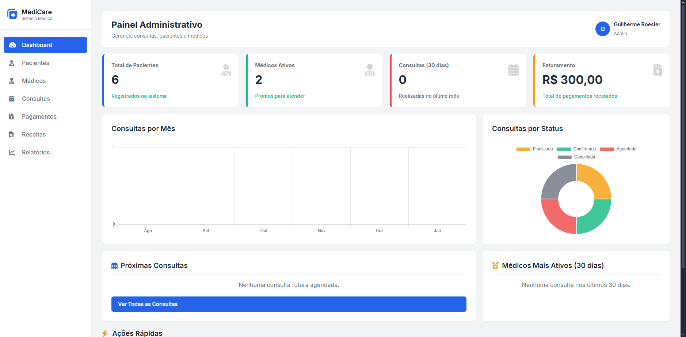

# MediCare System

Sistema web de gerenciamento de clínicas médicas: pacientes, médicos, consultas, pagamentos, receitas, dashboard e relatórios.



## Demonstração

| Item | Valor |
|------|--------|
| **Repositório** | https://github.com/GuilhermeRoesler/MediCare |
| **Demo estática (GitHub Pages)** | https://guilhermeroesler.github.io/MediCare/ |
| **Demo completa (Docker local)** | http://localhost:8080 |
| **Admin** | `admin@medicare.com` / `123456` |
| **Recepção** | `recepcao@medicare.com` / `123456` |

### Demo no GitHub Pages

A pasta `docs/` contém uma **vitrine estática** (HTML/CSS/JS) com o visual do sistema e dados mock do seed. Funciona no GitHub Pages porque **não executa PHP**.

- Login simulado → abre o dashboard
- Navegação, busca/ordenação nas tabelas e gráficos Chart.js
- CRUD, filtros de relatório e export CSV **desabilitados** (toast de “somente leitura”)

O workflow `.github/workflows/pages.yml` publica `docs/` automaticamente. No GitHub: **Settings → Pages → Source: GitHub Actions**.

Para a demo **completa** (login real, banco, CRUD), use Docker local ou um VPS com PHP 8.2 + MySQL.

## Funcionalidades

- Autenticação com hash de senha, sessões e proteção CSRF
- Perfis de usuário (`admin` e `recepção`)
- Dashboard com KPIs e gráficos (Chart.js)
- CRUD de pacientes, médicos, consultas, pagamentos e receitas
- Relatórios com filtros reais (período e médico) e exportação CSV
- Busca e ordenação nas tabelas
- Layout responsivo com menu mobile

## Stack

- **Backend:** PHP 8.1+ (OOP), PDO/MySQL
- **Frontend:** HTML5, CSS3, JavaScript (Vanilla)
- **Infra:** Docker Compose, GitHub Actions (lint + PHPUnit + Pages)
- **Libs UI:** Font Awesome, Chart.js, Inter (Google Fonts)

## Arquitetura

Aplicação multi-página (MPA) com separação clara:

```
app/                  # Código protegido (sem acesso HTTP direto)
  Core/               # Conexao, Auth, Csrf, bootstrap
  Models/             # Acesso a dados (PDO prepared statements)
  Http/Controllers/   # Entry points legados (redirecionam)

public/               # Document root
  actions/            # Endpoints POST autenticados + CSRF
  partials/           # Layout (head, sidebar, header, footer)
  *.php               # Páginas da UI
```

**Decisões:** MPA em PHP puro para simplicidade de deploy e aprendizado claro de HTTP/sessões; PDO preparado contra SQL injection; tokens CSRF em todos os formulários; Document Root em `public/` para isolar Models/Core.

## Início rápido com Docker

```bash
git clone https://github.com/GuilhermeRoesler/MediCare.git
cd MediCare
docker compose up --build -d
```

Acesse http://localhost:8080 e entre com `admin@medicare.com` / `123456`.

O MySQL sobe na porta `3307` (host) e o schema/seed de `database.sql` é importado automaticamente.

## Instalação manual (XAMPP / WAMP)

1. Clone o repositório e aponte o Document Root do Apache para a pasta `public/` (recomendado) **ou** acesse via `/MediCare/public/`.
2. Crie o banco e importe o seed:

```bash
mysql -u root -p < database.sql
```

3. Configure o ambiente:

```bash
cp .env.example .env
# Edite DB_HOST, DB_NAME, DB_USER e DB_PASS
```

4. Abra `http://localhost/.../public/autenticacao.php`.

## Testes e CI

```bash
composer install
composer test
```

O workflow em `.github/workflows/ci.yml` valida sintaxe PHP e executa o PHPUnit em push/PR. O workflow `pages.yml` publica a demo estática de `docs/`.

## Segurança (destaques)

- Senhas com `password_hash` / `password_verify`
- Sessão obrigatória em páginas e actions
- Token CSRF em formulários
- Pasta `app/` bloqueada via `.htaccess`
- Saída HTML escapada com `htmlspecialchars` nas listagens

## Estrutura

```
/
├── app/
│   ├── Core/
│   ├── Http/Controllers/
│   └── Models/
├── public/               # App PHP (document root)
├── docs/                 # Demo estática (GitHub Pages)
│   ├── index.html
│   ├── dashboard.html
│   ├── css/
│   └── js/
├── tests/
├── database.sql
├── docker-compose.yml
├── Dockerfile
├── composer.json
└── README.md
```

## Licença

MIT — veja [LICENSE](LICENSE).
